# many-rs
[](https://app.circleci.com/pipelines/gh/liftedinit/many-rs)
[](https://app.codecov.io/gh/liftedinit/many-rs)
[](https://github.com/liftedinit/many-rs/blob/main/LICENSE)

A collection of applications and libraries for the [MANY protocol](https://github.com/many-protocol).

Features
- A ledger client/server
- A key-value store client/server
- An application blockchain interface (ABCI)
- A http proxy
- A 4-nodes end-to-end Docker demo
- MANY module interfaces
- MANY common types
- MANY message and transport layers
- MANY client and server
- CLI developer's tools
- Hardware Security Module
- CLI developer's tools

# Installation

1. (macOS) Install `brew`
    ```shell
    # Follow the instructions on screen
    $ /bin/bash -c "$(curl -fsSL https://raw.githubusercontent.com/Homebrew/install/HEAD/install.sh)"
    ```
1. Update your package database
    ```shell
    # Ubuntu
    $ sudo apt update
    
    # CentOS
    $ sudo yum update
    
    # Archlinux
    $ sudo pacman -Syu
    
    # macOS
    $ brew update
    ```
1. Install Rust using [rustup](https://rustup.rs/)
    ```shell
    $ curl --proto '=https' --tlsv1.2 -sSf https://sh.rustup.rs | sh
    $ source $HOME/.cargo/env
    ```
2. Install build dependencies
    ```shell
    # Ubuntu
    $ sudo apt install build-essential pkg-config clang libssl-dev libsofthsm2 tmux
    
    # CentOS
    $ sudo yum install clang gcc softhsm git pkgconf tmux
    
    # Archlinux
    $ sudo pacman -S clang gcc softhsm git pkgconf tmux
    
    # macOS
    $ git # and follow the instructions
    $ brew install tmux
    ```
3. Build
    ```shell
    $ git clone https://github.com/liftedinit/many-framework.git
    $ cd many-framework
    $ cargo build
    ```
4. Run tests
    ```shell
    $ cargo test
    ```

# Usage example
Below are some examples of how to use the different CLI.

## Requirements
1. Install `tendermint`
    1. Download `tendermint` **v0.35.4** from https://github.com/tendermint/tendermint/releases/tag/v0.35.4
    2. Extract the archive
    3. Put the path to the `tendermint` executable in your `$PATH`
2. Install the `many` CLI

```shell 
$ cargo install --git https://github.com/liftedinit/many-rs many-cli
```

3. Generate a new key and get its MANY ID
```shell
# Generate a new Ed25519 key
$ ssh-keygen -a 100 -q -P "" -m pkcs8 -t ecdsa -f id1.pem

# Get the MANY ID of the key
$ many id id1.pem
maeguvtgcrgXXXXXXXXXXXXXXXXXXXXXXXXwqg6ibizbmflicz
```

4. Assign some tokens to your MANY ID by adding it to the `initial` section of the `staging/ledger_state.json5` file
```json5
    "maeguvtgcrgXXXXXXXXXXXXXXXXXXXXXXXXwqg6ibizbmflicz": {
      "MFX": 123456789
    }
```

5. (Dev) Comment the `hash` entry from the `staging/ledger_state.json5` file
```json5
  // hash: "fc0041ca4f7d959fe9e5a337e175bd8a68942cad76745711a3daf820a159f7eb"
```

## Run a blockchain key-value store and ledger
```shell
# The script will start a `tmux` instance containing 7 panes
#   0: Tendermint ledger
#   1: Tendermint key-value store
#   2: ledger server
#   3: ledger application blockchain interface (port 8000)
#   4: key-value store server
#   5: key-value store application blockchain interface (port 8011)
#   6: http proxy
$ ./scripts/run.sh
```

## Run a non-blockchain ledger server
```shell
# Follow the instructions from the `Requirements` section above before running this example.

# Run the ledger server using the provided initial state and key. 
# Create a clean persistent storage.
$ ./target/debug/many-ledger --pem id1.pem --state ./staging/ledger_state.json5 --persistent ledger.db --clean
2022-07-05T18:21:45.598272Z  INFO many_ledger: address="maeguvtgcrgXXXXXXXXXXXXXXXXXXXXXXXXwqg6ibizbmflicz"
2022-07-05T18:21:45.625108Z  INFO many_ledger::module: height=0 hash="fc0041ca4f7d959fe9e5a337e175bd8a68942cad76745711a3daf820a159f7eb"
```

## Query balance
```shell
# Follow the instructions from the `Requirements` section above before running this example.

# You must have a running ledger server before running this example.
# See section `Run a non-blockchain ledger server` above.
# See section `Run a blockchain key-value store and ledger` above.
$ ./target/debug/ledger --pem id1.pem balance
   123456789 MFX (mqbfbahksdwaqeenayy2gxke32hgb7aq4ao4wt745lsfs6wiaaaaqnz)
```

## Send tokens
```shell
# Follow the instructions from the `Requirements` section above before running this example.

# You must have a running ledger server before running this example.
# See section `Run a non-blockchain ledger server` above.
# See section `Run a blockchain key-value store and ledger` above.

# Generate a random key and get its MANY ID
$ ssh-keygen -a 100 -q -P "" -m pkcs8 -t ecdsa -f tmp.pem
$ many id tmp.pem
maf4byfbrz7dcc72tgb5zbof75cs52wg2fwbc2fdf467qj2qcx

# Send tokens from id1.pem to tmp.pem
$ ./target/debug/ledger --pem id1.pem send maf4byfbrz7dcc72tgb5zbof75cs52wg2fwbc2fdf467qj2qcx 10000 MFX

# Check the balance of the new ID
$ ./target/debug/ledger --pem tmp.pem balance
       10000 MFX (mqbfbahksdwaqeenayy2gxke32hgb7aq4ao4wt745lsfs6wiaaaaqnz)
```

## `many` CLI
Below are some examples of how to use the `many` CLI.

## Retrieve the MANY ID of a key
```shell
# Generate a new Ed25519 key
$ openssl genpkey -algorithm Ed25519 -out id1.pem

# Print the MANY ID of the key
$ ./target/debug/many id id1.pem
mafdzlw6ktmpncikho6wwswzej7rpja7fgtbn33xzwkfngdygc
```

## Retrieve the status of a running MANY server
```shell
$ ./target/debug/many message --server https://alberto.app/api 'status' '{}'
{_
    0: 1,
    1: "AbciModule(many-ledger)",
    2: h'a5010103270481022006215820e5cd546d5292af5d9f0ffd54b57ff555c51b91a249b9cf544010a3c01cfa75a2',
    3: 10000_1(h'01378dd9916915fb276116ff4bc13c04a4e413f663e04b710199c46021'),
    4: [0, 1, 2, 4, 6, 8, 9, 1002_1],
    5: "0.1.0",
    7: 300_1,
}
```

# Crates

Here's a list of crates published by this repository and their purposes.
You can visit their crates entries (linked below) for more information.

The dependency graph between the crates in this repository looks like this:

```mermaid
graph TD;
  many-client --> http_proxy;
  many-identity --> http_proxy;
  many-identity-dsa --> http_proxy;
  many-modules --> http_proxy;
  many-client --> kvstore;
  many-error --> kvstore;
  many-identity --> kvstore;
  many-identity-dsa --> kvstore;
  many-modules --> kvstore;
  many-protocol --> kvstore;
  many-types --> kvstore;
  many-modules --> ledger-db;
  many-types --> ledger-db;
  many-client --> ledger;
  many-error --> ledger;
  many-identity --> ledger;
  many-identity-dsa --> ledger;
  many-identity-hsm --> ledger;
  many-modules --> ledger;
  many-protocol --> ledger;
  many-types --> ledger;
  many-client --> many-abci;
  many-error --> many-abci;
  many-identity --> many-abci;
  many-identity-dsa --> many-abci;
  many-identity-webauthn --> many-abci;
  many-modules --> many-abci;
  many-protocol --> many-abci;
  many-server --> many-abci;
  many-types --> many-abci;
  many-client-macros --> many-client;
  many-identity --> many-client;
  many-identity-dsa --> many-client;
  many-modules --> many-client;
  many-protocol --> many-client;
  many-server --> many-client;
  many-types --> many-client;
  many-error --> many-identity-dsa;
  many-identity --> many-identity-dsa;
  many-protocol --> many-identity-dsa;
  many-error --> many-identity-hsm;
  many-identity --> many-identity-hsm;
  many-identity-dsa --> many-identity-hsm;
  many-protocol --> many-identity-hsm;
  many-error --> many-identity-webauthn;
  many-identity --> many-identity-webauthn;
  many-identity-dsa --> many-identity-webauthn;
  many-modules --> many-identity-webauthn;
  many-protocol --> many-identity-webauthn;
  many-types --> many-identity-webauthn;
  many-error --> many-identity;
  many-error --> many-kvstore;
  many-identity --> many-kvstore;
  many-identity-dsa --> many-kvstore;
  many-modules --> many-kvstore;
  many-protocol --> many-kvstore;
  many-server --> many-kvstore;
  many-types --> many-kvstore;
  many-client --> many-ledger;
  many-error --> many-ledger;
  many-identity --> many-ledger;
  many-identity-dsa --> many-ledger;
  many-identity-webauthn --> many-ledger;
  many-ledger-test-macros --> many-ledger;
  many-ledger-test-utils --> many-ledger;
  many-migration --> many-ledger;
  many-modules --> many-ledger;
  many-protocol --> many-ledger;
  many-server --> many-ledger;
  many-types --> many-ledger;
  many-error --> many-migration;
  many-client --> many-mock;
  many-error --> many-mock;
  many-identity --> many-mock;
  many-identity-dsa --> many-mock;
  many-identity-webauthn --> many-mock;
  many-modules --> many-mock;
  many-protocol --> many-mock;
  many-server --> many-mock;
  many-error --> many-modules;
  many-identity --> many-modules;
  many-identity-dsa --> many-modules;
  many-macros --> many-modules;
  many-protocol --> many-modules;
  many-types --> many-modules;
  many-error --> many-protocol;
  many-identity --> many-protocol;
  many-types --> many-protocol;
  many-error --> many-server;
  many-identity --> many-server;
  many-identity-dsa --> many-server;
  many-macros --> many-server;
  many-modules --> many-server;
  many-protocol --> many-server;
  many-types --> many-server;
  many-error --> many-types;
  many-identity --> many-types;
  many-client --> many;
  many-error --> many;
  many-identity --> many;
  many-identity-dsa --> many;
  many-identity-hsm --> many;
  many-identity-webauthn --> many;
  many-mock --> many;
  many-modules --> many;
  many-protocol --> many;
  many-server --> many;
  many-types --> many;
```

<!-- To generate this graph, see the `scripts/deps.sh` script. -->



## Published to crates.io

* `many`([crates](https://crates.io/crate/many), [docs](https://docs.rs/many))
    – Contains the CLI tool to contact and diagnose MANY servers.
* `many-client`([crates](https://crates.io/crate/many-client), [docs](https://docs.rs/many-client))
  – Types and methods to talk to the MANY network.
* `many-error`([crates](https://crates.io/crate/many-error), [docs](https://docs.rs/many-error))
    – Error and Reason types, as defined by the specification.
* `many-identity`([crates](https://crates.io/crate/many-identity), [docs](https://docs.rs/many-identity))
    – Types for managing an identity, its address and traits related to signing/verification of messages.
* `many-identity-dsa`([crates](https://crates.io/crate/many-identity-dsa), [docs](https://docs.rs/many-identity-dsa))
    – Digital Signature identity, verifiers and utility functions. 
      This crate has features for all supported algorithms (e.g. `ed25519`).
* `many-identity-hsm`([crates](https://crates.io/crate/many-identity-hsm), [docs](https://docs.rs/many-identity-hsm))
    – Hardware Security Module based identity, verifiers and utility functions.
* `many-identity-webauthn`([crates](https://crates.io/crate/many-identity-webauthn), [docs](https://docs.rs/many-identity-webauthn))
    – Verifiers for WebAuthn signed envelopes.
      This uses our custom WebAuthn format, which is not fully compliant with the [WebAuthn standard](https://webauthn.io).
      See the [Lifted WebAuthn Auth Paper](https://coda.io/@hans-larsen/lifted-webauthn-auth).
* `many-macros`([crates](https://crates.io/crate/many-macros), [docs](https://docs.rs/many-macros))
    – Contains macros to help with server and module declaration and implementations.
* `many-mock`([crates](https://crates.io/crate/many-mock), [docs](https://docs.rs/many-mock))
    – Utility types for creating mocked MANY servers.
* `many-modules`([crates](https://crates.io/crate/many-modules), [docs](https://docs.rs/many-modules))
    – All modules declared in the specification.
* `many-protocol`([crates](https://crates.io/crate/many-protocol), [docs](https://docs.rs/many-protocol))
    – Types exclusively associated with the protocol.
      This does not include types that are related to attributes or modules.
* `many-server`([crates](https://crates.io/crate/many-server), [docs](https://docs.rs/many-server))
    – Types and methods to create a MANY network server and neighborhood.
* `many-types`([crates](https://crates.io/crate/many-types), [docs](https://docs.rs/many-types))
  – General types related to CBOR encoding, or to the specification.


# References

- Concise Binary Object Representation (CBOR): [RFC 8949](https://www.rfc-editor.org/rfc/rfc8949.html)
- CBOR Object Signing and Encryption (COSE): [RFC 8152](https://datatracker.ietf.org/doc/html/rfc8152)
- Platform-independent API to cryptographic tokens: [PKCS #11](https://docs.oasis-open.org/pkcs11/pkcs11-base/v2.40/os/pkcs11-base-v2.40-os.html)
- Blockchain application platform: [Tendermint](https://docs.tendermint.com/master/)
- Persistent key-value store: [RocksDB](https://rocksdb.org/)
- Concise Binary Object Representation (CBOR): [RFC 8949](https://www.rfc-editor.org/rfc/rfc8949.html)
- CBOR Object Signing and Encryption (COSE): [RFC 8152](https://datatracker.ietf.org/doc/html/rfc8152)
- Platform-independent API to cryptographic tokens: [PKCS #11](https://docs.oasis-open.org/pkcs11/pkcs11-base/v2.40/os/pkcs11-base-v2.40-os.html)


# Developer tools

- CBOR playground: [CBOR.me](https://cbor.me)
- CBOR diagnostic utilities: [cbor-diag](https://github.com/cabo/cbor-diag)
- Software Hardware Security Module (HSM): [SoftHSM2](https://github.com/opendnssec/SoftHSMv2)
- Bash automated testing system: [bats-core](https://github.com/bats-core/bats-core)
- Container engine: [Docker](https://www.docker.com/)
- The MANY libraries: [many-rs](https://github.com/liftedinit/many-rs)

# Contributing

1. Read our [Contributing Guidelines](https://github.com/liftedinit/.github/blob/main/docs/CONTRIBUTING.md)
2. Fork the project (https://github.com/liftedinit/many-rs/fork)
3. Create a feature branch (`git checkout -b feature/fooBar`)
4. Commit your changes (`git commit -am 'Add some fooBar'`)
5. Push to the branch (`git push origin feature/fooBar`)
6. Create a new Pull Request (https://github.com/liftedinit/many-rs/pull/new)
