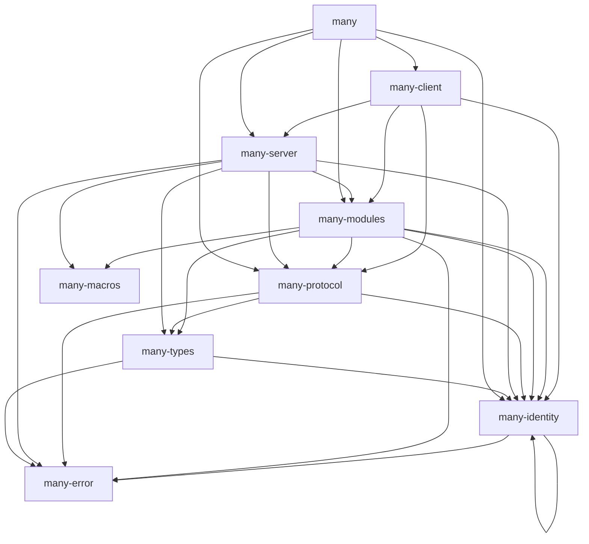

# many-rs
[](https://app.circleci.com/pipelines/gh/liftedinit/many-rs)
[](https://app.codecov.io/gh/liftedinit/many-rs)
[](https://github.com/liftedinit/many-rs/blob/main/LICENSE)

Rust libraries for the [MANY protocol](https://github.com/many-protocol).

Features
- MANY module interfaces
- MANY common types
- MANY message and transport layers
- MANY client and server
- Hardware Security Module
- CLI developer's tools

# References

- Concise Binary Object Representation (CBOR): [RFC 8949](https://www.rfc-editor.org/rfc/rfc8949.html)
- CBOR Object Signing and Encryption (COSE): [RFC 8152](https://datatracker.ietf.org/doc/html/rfc8152)
- Platform-independent API to cryptographic tokens: [PKCS #11](https://docs.oasis-open.org/pkcs11/pkcs11-base/v2.40/os/pkcs11-base-v2.40-os.html)

# Developer tools

- CBOR playground: [CBOR.me](https://cbor.me)
- CBOR diagnostic utilities: [cbor-diag](https://github.com/cabo/cbor-diag)
- Software Hardware Security Module (HSM): [SoftHSM2](https://github.com/opendnssec/SoftHSMv2)

# Crates

Here's a list of crates published by this repository and their purposes.
You can visit their crates entries (linked below) for more information.

The dependency graph between the crates in this repository looks like this:

<!-- To generate this graph, see the `scripts/deps.sh` script. -->



* `many`([crates](https://crates.io/crate/many), [docs](https://docs.rs/many))
    – Contains the CLI tool to contact and diagnose MANY servers.
* `many-error`([crates](https://crates.io/crate/many-error), [docs](https://docs.rs/many-error))
    – Error and Reason types, as defined by the specification.
* `many-identity`([crates](https://crates.io/crate/many-identity), [docs](https://docs.rs/many-identity))
    – Types for managing an identity, its address and signing/verification of messages.
* `many-types`([crates](https://crates.io/crate/many-types), [docs](https://docs.rs/many-types))
    – General types related to CBOR encoding, or to the specification.
* `many-macros`([crates](https://crates.io/crate/many-macros), [docs](https://docs.rs/many-macros))
    – Contains macros to help with server and module declaration and implementations.
* `many-modules`([crates](https://crates.io/crate/many-modules), [docs](https://docs.rs/many-modules))
    – All modules declared in the specification.
* `many-protocol`([crates](https://crates.io/crate/many-protocol), [docs](https://docs.rs/many-protocol))
    – Types exclusively associated with the protocol.
      This does not include types that are related to attributes or modules.
* `many-client`([crates](https://crates.io/crate/many-client), [docs](https://docs.rs/many-client))
    – Types and methods to talk to the MANY network.
* `many-server`([crates](https://crates.io/crate/many-server), [docs](https://docs.rs/many-server))
    – Types and methods to create a MANY network server and neighborhood.

# Installation

1. Update your package database
```shell
# Ubuntu
$ sudo apt update

# CentOS
$ sudo yum update

# Archlinux
$ sudo pacman -Syu
```
2. Install Rust using [rustup](https://rustup.rs/)
```shell
$ curl --proto '=https' --tlsv1.2 -sSf https://sh.rustup.rs | sh
$ source $HOME/.cargo/env
```
3. Install build dependencies
```shell
# Ubuntu
$ sudo apt install build-essential pkg-config clang libssl-dev libsofthsm2

# CentOS
$ sudo yum install clang gcc softhsm git pkgconf

# Archlinux
$ sudo pacman -S clang gcc softhsm git pkgconf

# macOS
$ git # and follow the instructions
```
4. Build `many-rs`
```shell
$ git clone https://github.com/liftedinit/many-rs.git
$ cd many-rs
$ cargo build
```
5. Run tests
```shell
$ cargo test
```

# Usage example
Below are some examples of how to use the `many` CLI.

## Retrieve the MANY ID of a key
```shell
# Generate a new Ed25519 key
$ openssl genpkey -algorithm Ed25519 -out id1.pem

# Print the MANY ID of the key
$ ./target/debug/many id id1.pem
mafdzlw6ktmpncikho6wwswzej7rpja7fgtbn33xzwkfngdygc
```

## Retrieve the status of a running MANY server
```shell
$ ./target/debug/many message --server https://alberto.app/api 'status' '{}'
{_
    0: 1,
    1: "AbciModule(many-ledger)",
    2: h'a5010103270481022006215820e5cd546d5292af5d9f0ffd54b57ff555c51b91a249b9cf544010a3c01cfa75a2',
    3: 10000_1(h'01378dd9916915fb276116ff4bc13c04a4e413f663e04b710199c46021'),
    4: [0, 1, 2, 4, 6, 8, 9, 1002_1],
    5: "0.1.0",
    7: 300_1,
}
```

# Contributing

1. Read our [Contributing Guidelines](https://github.com/liftedinit/.github/blob/main/docs/CONTRIBUTING.md)
2. Fork the project (https://github.com/liftedinit/many-rs/fork)
3. Create a feature branch (`git checkout -b feature/fooBar`)
4. Commit your changes (`git commit -am 'Add some fooBar'`)
5. Push to the branch (`git push origin feature/fooBar`)
6. Create a new Pull Request (https://github.com/liftedinit/many-rs/pull/new)
